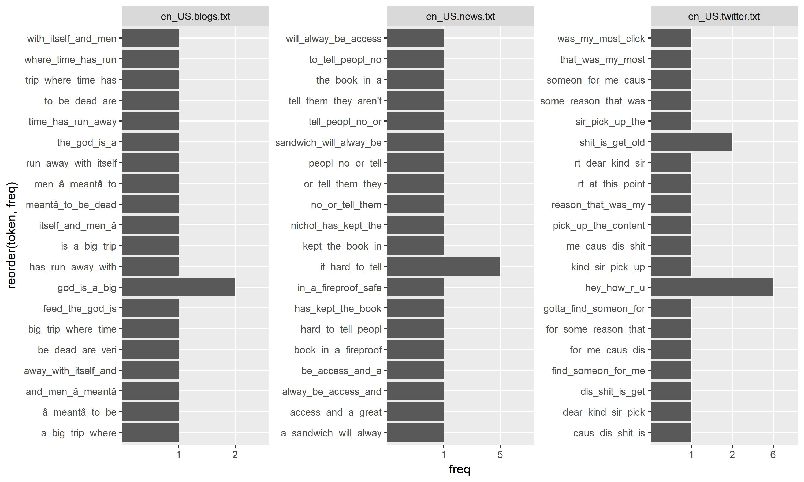

```{r setup, include=FALSE}
knitr::opts_chunk$set(echo = TRUE, warning=FALSE)
library(R.utils)
library(dplyr)
library("ggplot2")
library("Rmisc")
library("data.table")
library("e1071")
library("caret")
library("quanteda")
library("irlba")
library("randomForest")
library("knitr")
```

## Excutative Summary

This report is a exploratory analysis of swiftkey dataset. The dataset contains different locales and the data comes from blogs, twitter and news. The goal for us is to build a N -gram model using the training data and predict the next word based on the word sequence provided.

## Download and read the data

We have downloaded the dataset and extracted locally. We can see there are 4 locales, each locales contains 3 dataset, twitter, blogs, and news. 

```{r downloaddata, echo=FALSE, warning=FALSE}

if (!file.exists("swiftdata.zip"))
{
    url="https://d396qusza40orc.cloudfront.net/dsscapstone/dataset/Coursera-SwiftKey.zip"
    download.file(url, "swiftdata.zip")
    unzip("swiftdata.zip")
}

```

```{r file_size, echo=FALSE, warning=FALSE}
all_dirs <- c("final/en_US/", "final/de_DE/", "final/fi_FI/", "final/ru_RU/")
allFiles <- c()
for (d in all_dirs)
{
    allFiles = c(allFiles, paste(d, list.files(d), sep=""))
    
}
#allFiles
```

We can count the # of lines in each file by implementing a utility function getCountOfLines using the command "wc -l". Here is the line count output.

```{r getCountOf_Lines, echo=FALSE, warning=FALSE}
getCountOfLines <- function(fileName)
{
    
    wcOut <- system(paste("wc -lc", fileName, sep=" "), intern =TRUE)
    maxL <- as.numeric(strsplit(wcOut, split="\\s+")[[1]][[2]])
    maxW <- as.numeric(strsplit(wcOut, split="\\s+")[[1]][[3]])
    as.matrix(cbind(maxL, maxW), ncol=2)
}
lc <- c()

for (f in allFiles)
{
    cnt <- getCountOfLines(f)
    lc <- rbind(lc, cnt)
}
lcntTable <- as.data.frame(as.matrix(cbind(allFiles, lc), ncol=3))
names(lcntTable) <- c("filename", "linecount", "wordcount")
lcntTable
```
## Building Word frequency table using the n-gram model

We will start with analyze the text using the data mining package quanteda. This package allow use to clean the text data including exclude the stop words, punctuation, numbers, and symbols. 

Since we need to predict the word using n-gram, we will try build bi-gram, tri-gram, and qudra-gram. For bi-gram, the 1st word will be used to predict the next word (outcome). For the tri-gram, the first two words will be used to preduct the last word. For quadra gram, the first three words will be used to preduct the last word.
  
  We tokenize our corpus first for each file, and build a sparse matrix of the n-gram tokens with the count of occurance, then we sum up all the count to build the frequency for each n-gram token.
  
  Due to the size of the file is huge, we will use the sampling method to avoid using excessive memory, we can use k-folds to do multiple training later or to read the entire corpus. Since our training corpus containing different locale and different text source, we will make our model seperate for each source. 
 
```{r quanteda_fragment, echo=TRUE, eval=FALSE}
 train.tokens <- tokens_wordstem(train.tokens, 
                                    language = getStemLanguage(localeName))
 train.tokens <- tokens_ngrams(train.tokens, n = nGramModelUnit)
```
```{r quanteda_model, echo=FALSE}

getFrequency<-function(ds)
{
    #transpose the ds to build a frequency model
   
    tf <- as.data.frame(t(ds))
    tf$freq <- rowSums(tf, na.rm=TRUE, dims=1)
    tf <- as.data.frame(tf[,"freq"])
    colnames(tf) <- "freq"
    rownames(tf) <- colnames(ds)
    subset(tf, freq==1)
    rm(ds)
    gc()
    tf
}

getStemLanguage <- function(localeName)
{
    l <- "english"
    if (localeName == "de_DE")
        l <- "german"
    if (localeName == "ru_RU")
        l <- "russian"
    if (localeName == "fi_FI")
        l <- "french"
    l
}

buildNGramModel<-function(ds, nGramModelUnit, prevMatrix, localeName)
{
    
    #print("building ngram model for data frame...")
    # Tokenize SMS text messages.
    train.tokens <- tokens(ds, what = "word", 
                           remove_numbers = TRUE, remove_punct = TRUE,
                           remove_symbols = TRUE, remove_hyphens = TRUE)
    
    train.tokens <- tokens_wordstem(train.tokens, 
                                    language = getStemLanguage(localeName))
    train.tokens <- tokens_ngrams(train.tokens, n = nGramModelUnit)
    train.tokens.dfm <- dfm(train.tokens, tolower = TRUE)
    train.tokens.matrix <- as.matrix(train.tokens.dfm)
    ds <- as.data.frame(train.tokens.matrix)
    
    currMatrix <- getFrequency(ds)
    ## Add a new column named token
    currMatrix$token <- rownames(currMatrix)
    rownames(currMatrix) <- seq(1, nrow(currMatrix))
    #print(paste("Current # of features:", length(rownames(currMatrix))))
    
    if (length(prevMatrix) > 0)
    {
        f <- full_join(prevMatrix, currMatrix, by="token")
        
        f <- f %>%
            mutate(freq.x = ifelse(is.na(freq.x), 0, freq.x)) %>%
            mutate(freq.y = ifelse(is.na(freq.y), 0, freq.y))
        ret <- f %>%
            mutate(freq=freq.x+freq.y)  %>%
            dplyr::select(freq, token)
        
            
    }
    else
    {
        ret <- currMatrix
    }
    rm(train.tokens.matrix)
    rm(train.tokens)
    rm(train.tokens.dfm)
    gc()
    colnames(ret) <- c("freq", "token")
    ret
}
readF <- function(fileName, startingLine, readLineCount)
{
    f <- file(fileName)
    allLines <- read.table(f, skip=startingLine, nrow=readLineCount, quote="", sep="\n", as.is=TRUE)
    allLines
}

buildModel <- function(fileName, totalLines, nGramUnit, samplePercent, localeName)
{
    
    #print(paste("reading files:", fileName, ":", totalLines))
    
    ## We will get around 5% of sample lines if it's greater than 10000 lines
    ## each time we will sampling the countLines and take from a random
    ## segment of the file (i.e. if the # of lines are 10000, and sampleCount is 5000)
    # We will sample a integer vector of (1:95000) as starting point,
    # and read 5000 lines from the starting point
    startingLine <- 1
    readLineCount <- totalLines
    if (totalLines > 10000)
    {
        readLineCount <- floor(totalLines*samplePercent)
        
        set.seed(10000)
        startingLine <- sample(1:totalLines-readLineCount, 1)
    }
    #print(paste("starting sample line #", startingLine, ",read line count:",readLineCount))
    currData <- readF(fileName,startingLine, readLineCount)
    currMatrix <- c()
   
    for (n in 1 : floor((readLineCount+1)/1000))
    {
        #print(paste("Start reading the",n, "batch"))
        k <- (n-1) * 1000
        
        #print(paste("process in batch:", startingLine+k-1))
        index <- seq(k+1,k+1000)
        currDS <- currData[index, 1]
        # This build 1 to 4 ngrams model
        # Since the # of lines is big, we will do incremental approach 
        # to combine the N gram model
        currMatrix <- buildNGramModel(as.character(currDS), nGramUnit, currMatrix, localeName)
     
    }
   
    #print(object.size(currMatrix))
    currMatrix
     
     
}
```

## Top 20 n-grams  
We obtain the model for each data source. Here are the top 20 frequent n-grams obtained from each file and their frequencies.  

```{r analyze_model, echo=FALSE, fig.height=6, fig.width=10}

saveStat <- function(fileName, samplePercent, nGramUnit, stat_list, diffSec, m)
{
    #print(paste("save stat", fileName, samplePercent, nGramUnit, length(stat_list), diffSec, nrow(m)))
    curFrame <- as.data.frame(
                    as.matrix(
                        cbind(basename(fileName), samplePercent, nGramUnit, 
                              diffSec, nrow(m)), ncol=5))
    names(curFrame) <- c("filename", "sample_size", 
                         "ngramUnits", "timespent", "tokens")
    #print(curFrame)
        # Save the model statistics
    if (length(stat_list) == 0)
    {
        stat_list <- as.data.frame(curFrame)
    }
    else {
        stat_list <- as.data.frame(rbind(stat_list, curFrame))
    }
    names(stat_list) <- c("filename", "sample_size", "ngramUnits", "timespent", "tokens")
    stat_list
    
}
getModelFileName <-function(fileName, nGramUnit, samplePercent)
{
    storeRDSName <- paste("results/", fileName, "_", 
                          as.character(nGramUnit), "_",
                          as.character(samplePercent), ".rds", sep="")
    storeRDSName
}
getModelOnDemand <- function(fileName, nGramUnit, samplePercent, rebuild, localeName)
{
    

    storeRDSName <- getModelFileName(fileName, nGramUnit, samplePercent)
    if (!dir.exists(dirname(storeRDSName)))
    {
        dir.create(dirname(storeRDSName), recursive=TRUE)
    }
    m <- c()
    if (file.exists(storeRDSName) & rebuild==FALSE)
    {
        m <- readRDS(storeRDSName)
        #print(paste("reading the saved model", storeRDSName))
    }
    
    if (length(m) == 0)
    {
        s <- subset(lcntTable, filename==fileName)
        lineCount = as.numeric(as.character(s[1,"linecount"]))
        m <- buildModel(fileName, lineCount, nGramUnit, samplePercent, localeName)
        #print(paste("stored the model in", storeRDSName))
        saveRDS(m, file=storeRDSName)
    }
    m
}

plotFrequencyForLocale <- function(localeName, nGramUnit, percentage)
{
    #print(paste("building", localeName, nGramUnit, percentage))
    index <- grepl(localeName, lcntTable$filename)
    usFileName <- as.character(lcntTable[index,]$filename)
    stat_list_file_name <- paste("stats_model_", localeName, ".rds", sep="")
    melted_data <- c()
    e <- file.exists(stat_list_file_name)
    stat_list <- c()
    for (f in usFileName)
    {
        if (!endsWith(basename(f), ".txt") | startsWith(f, "test"))
        {
            #print(paste("skipping ", basename(f)))
            next
        }
        
        start_time <- Sys.time()
        #print(paste("Begin time for analysis", f, start_time))
        eF <- file.exists(getModelFileName(f, nGramUnit, percentage))
        m <- getModelOnDemand(f, nGramUnit, percentage, !e, localeName)
        end_time <- Sys.time()
        #print(paste("End time for analysis", f, end_time))
        diffSec <- difftime(end_time, start_time, units="secs")
        if (!(eF & e))
        {
            stat_list <- saveStat(f, percentage, nGramUnit, stat_list, diffSec, m)
        }
        top20KeyWords <- head(m, 20)
        # recycle the big matrix since we already store it
        melted_data <- rbind(melted_data, as.data.frame(as.matrix(cbind(basename(f), top20KeyWords), ncol=3)))
        top20KeyWords$freq <- as.numeric(top20KeyWords$freq)
    }
    
    if (e == TRUE & length(stat_list) >0)
    {
        stat_list_saved <- readRDS(stat_list_file_name)
        # merge the saved stat_list with the current stat
        #print("Read stat_list_saved")
        #print(stat_list_saved)
        stat_list <- bind_rows(stat_list_saved, stat_list)
        #print("bindrows stat_list_saved and stat_list")
        #print(stat_list)
        saveRDS(stat_list, stat_list_file_name)
    }
    else if (length(stat_list) >0)
    {
        #print("Saved stat_list")
        #print(stat_list)
        saveRDS(stat_list, stat_list_file_name)
    }
    
    if (length(melted_data) == 0)
        stop("No data to plot")
    names(melted_data) <- c("filename", "freq", "token")
    melted_data <- melted_data %>%
        filter(!startsWith(basename(as.character(filename)), "test"))
    g<- ggplot(data=melted_data, aes(x=reorder(token, freq), y=freq)) +
        geom_bar(stat="identity") +
        coord_flip() +
        facet_wrap(~filename,scales="free")
    
    
    # only show on the report if it's en_US locale
    graphFileName <- paste(localeName, "_", 
                           as.character(nGramUnit), "gram", "_",
                           as.character(percentage), ".jpg", sep="")
    #print(paste("saved the graph to ", graphFileName))
    if (!file.exists(graphFileName))
    {
        ggsave(graphFileName, g, device="jpeg")
    }
    
}
nGramUnit <- c(rep(2, 3), rep(3, 3), rep(4,3))
percentage<- c(rep(c(0.01, 0.05, 0.1), 3))
locales <- c("en_US", "de_DE", "fi_FI", "ru_RU")

# Save the stats
s <- mapply(plotFrequencyForLocale, "en_US", nGramUnit, percentage)
```

Below is the bi gram sample size 0.1's top 20 frequent keywords

```{r bigram_graph, fig.width=6, fig.height=4}

```

Below is the tri-gram, sample size 0.1's top 20 frequent keywords

```{r trigram_graph, fig.width=6, fig.height=4}

```

Below is the 4-gram, sample size 0.1's top 20 frequent keywords
```{r quadra_graph, fig.width=6, fig.height=4}


```

## Statistics of the dataset

To check the performance and the statistics of the n-gram model we build, we listed the following stats in the table. From the table we can see the more sample size we build, the time spent are greater.

 - The sample size (1 percent, 5 percent and 10 percent of the line count)
 - Time spent in building the model
 - Number of of n grams in the model
 - Number of n grams that only appear once
```{r stat_list, echo=TRUE}
stat_list <- readRDS("stats_model_en_US.rds")
stat_list <- stat_list %>%
    mutate(filename=basename(as.character(filename))) %>%
    mutate(timespent=round(as.numeric(timespent)))
print(stat_list)
```

 We can also see percentage of n-grams that only happen once is quite high in 3-gram and 4-gram (almost 90% of the 4-gram only happen once)
 
```{r single_instance, echo=FALSE, fig.height=6, fig.width=10}
modelFileFolder <- "results/final/en_US/"

countSingleNGram <-function(files)
{
    c <- 0
    n <- 1
    single_list <- c()
    for (f in files)
    {
        if (grepl("en_US", f))
        {        
            #print(paste("coutning single ngram", f))
            fileFrag <- strsplit(f, split="_")[[1]]
            nGramUnit <- as.numeric(fileFrag[[3]])
            Percentage <- as.numeric(sub(".rds", "", fileFrag[[4]]))
            
            f <- paste(modelFileFolder, f, sep="")
            if (file.exists(f))
            {
                m <- readRDS(f)
                c <- nrow(subset(m, freq ==1))
                n <- nrow(m)
            }
            single_list <- bind_rows(single_list,
                      as.data.frame(as.matrix(cbind(nGramUnit, Percentage, c/n), ncol=3)))
        }
    }
    names(single_list) <- c("nGramUnit", "SampleSize", "PercentageOfSingleInstance")
    single_list
}

mNames <- list.files(modelFileFolder)
single_list <- countSingleNGram(mNames)

g <- ggplot(
    aes(x=SampleSize, 
        y=PercentageOfSingleInstance, 
        color=nGramUnit),data=single_list) +   
    geom_line() + 
    facet_wrap(~nGramUnit, nrow=1)
print(g)
```


## Goal of building Shiny App for Prediction Model

In order to build a shiny app so that non-data scientest can also use, we have following requirements

 - We need to allow user to choose on the shiny app which corpus source to build prediction from
 - We need to allow user to input text (1 to 3 words), need to check if user's language. 
 - After user input the above, we need to break down the input text to 1, 2, 3 word sequence and choose from the n-gram model and get the highest frequency from the n gram models. 
 - if the user input is not in the model (0 occurance), we will need to ask user to give us a hint and modify the model to include it, so it can learn from the user input on demand.
 

## Appendix
Source code for this rmd file can be find in github (https://github.com/jjtt8080/SwiftKey_Data_Capstone)